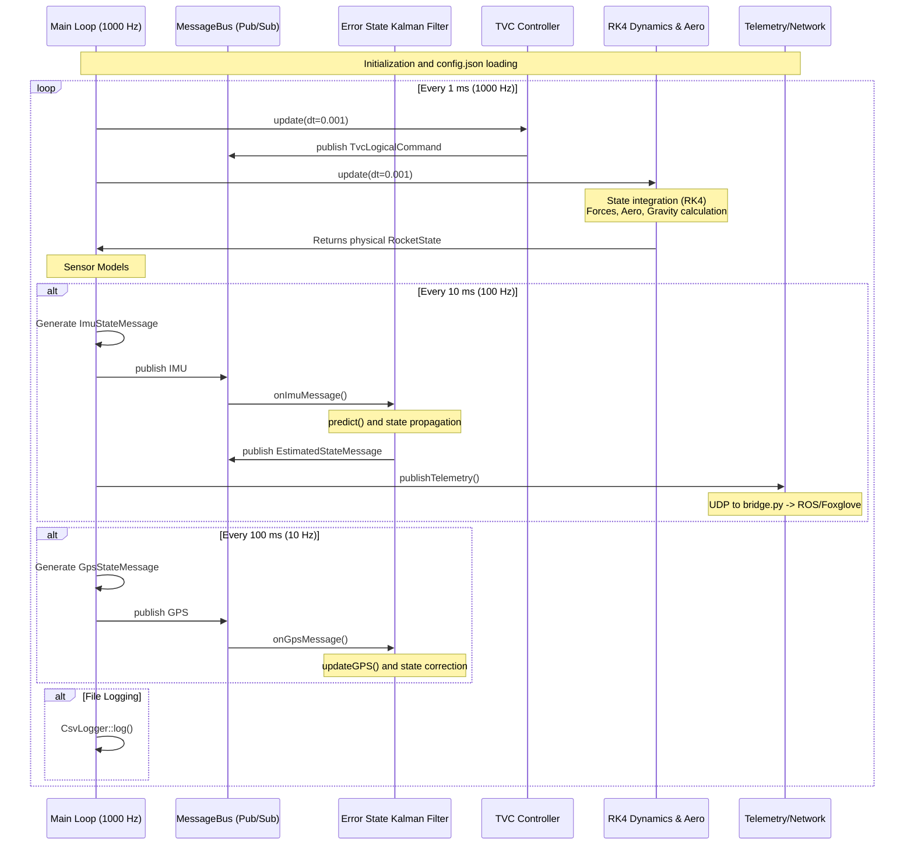

# System Architecture

The `simRocket` framework is built around a decoupled, modular architecture.

## Core Concepts

1. **Message Bus (`MessageBus`)**
   A thread-safe publish-subscribe system that connects sensors (like IMU), controllers (like TVC), and actuators. It mimics a real hardware CAN/Ethernet bus.

2. **Dynamics Model (`NativeRocketDynamicsModel`)**
   The core physics engine. It collects outputs from various sub-models (Engines, Actuators, Aero, Environment, Mass) and computes the Net Force and Net Torque.

3. **Interface Separation**
   - `IEngineModel`: Responsible only for calculating raw scalar thrust and mass flow (propellant depletion).
   - `IActuatorModel`: Responsible only for spatial transforms (e.g. pivoting a nozzle via a gimbal).

By combining `IEngineModel` and `IActuatorModel`, the dynamics model can simulate highly complex clusters of vectored engines.
# simRocket Architecture and Workflow

The following diagram illustrates the architecture of the simulator, showing how components are interconnected and at what sampling rates they are executed.

## Execution Details

- **Main Loop (1000 Hz)**: A deterministic lock-step loop responsible for simulation time. It enforces a strict time step of $dt = 1 \text{ ms}$, ensuring the accuracy of the RK4 integrator.
- **TVC Controller (1000 Hz)**: Even though physical actuators may be slower, the controller is executed in the main loop. It uses the asynchronously published `EstimatedStateMessage` to calculate angular errors.
- **IMU Sensor (100 Hz)**: The ideal state from the rocket dynamics is subjected to noise processes (Gaussian noise, random walk for biases). The IMU measurement result forms the basis for prediction in the EKF.
- **GPS Sensor (10 Hz)**: Provides spatial position measurements with a simulated delay.
- **Error State Kalman Filter**: Asynchronous. Triggered by the arrival of an `ImuStateMessage` (100 Hz), updating the estimated state and publishing the result for the TVC and Telemetry.
- **Telemetry Bridge (Python, 100 Hz)**: Runs in a separate process, decoding raw binary UDP frames in real-time and formatting them according to ROS definitions (e.g., for Foxglove).
